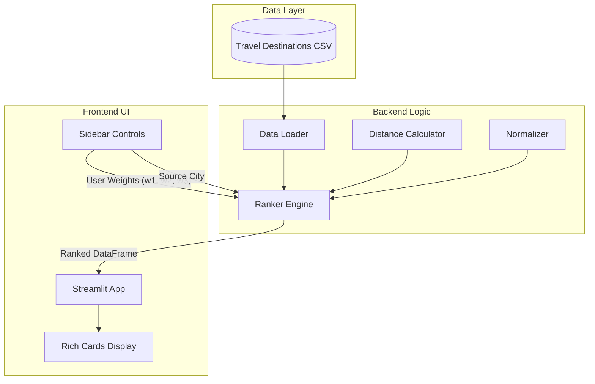

# 🚗 Weekend Getaway Ranker

> **Discover your perfect weekend escape.** A smart recommendation engine that ranks travel destinations based on your preferences using a weighted scoring algorithm.

<!-- Center this Link -->
[Weekend Destination Ranker App(Live Demo)](https://getaway-ranker.streamlit.app/)

---

## 🌟 Overview

The **Weekend Getaway Ranker** helps users find the best travel spots near major Indian cities (New Delhi, Mumbai, Bangalore). Unlike standard lists, this tool uses a configurable algorithm that balances:

* **Distance**: How far is it? (Closer is often better for weekends)
* **Rating**: quality of the destination.
* **Popularity**: Based on the volume of reviews.

It features a modern **Streamlit** interface with interactive controls, allowing you to personalize the ranking logic.

---

## 🏗️ Architecture

The system follows a clean modular architecture separating data, logic, and presentation.



---

## 🚀 Core Features

* **📍 Source-Based Ranking**: Calculates real-time distance from your chosen city.
* **🎚️ Dynamic Weighting**: You control what matters more—is it the *Rating* or the *Drive*?
* **🎨 Rich UI**: Beautiful destination cards with embedded metrics.
* **⚡ Optimized Performance**: Caching implemented for data loading and model initialization.

---

## 🛠️ Technology Stack

| Component | Tech | Purpose |
| :--- | :--- | :--- |
| **Language** |  | Core Logic |
| **Frontend** |  | User Interface |
| **Data** |  | Data Processing |
| **Testing** |  | Unit Testing |
| **Package Manager** |  | Fast Dependency Management |

---

## 🏃‍♂️ How to Run

### Option 1: Using `uv` (Recommended ⚡)

Reference: [astral.sh/uv](https://github.com/astral-sh/uv)

1. **Clone the repository**:

    ```bash
    git clone https://github.com/Subhendu-07/Aeka_Advisors/tree/main/3.weekend-getaway-ranker
    cd weekend-getaway-ranker
    ```

2. **Sync Dependencies**:

    ```bash
    uv sync
    ```

3. **Run the App**:

    ```bash
    uv run streamlit run app/main.py
    ```

    **Or run via Terminal CLI:**

    ```bash
    uv run main.py
    ```

4. **Run Tests**:

    ```bash
    uv run pytest
    ```

### Option 2: Using `pip` (Alternative 🐍)

1. **Clone the repository**:

    ```bash
    git clone https://github.com/Subhendu-07/Aeka_Advisors/tree/main/3.weekend-getaway-ranker
    cd weekend-getaway-ranker
    ```

2. **Install Requirements**:

    ```bash
    pip install -r requirements.txt
    ```

3. **Run the App**:

    ```bash
    streamlit run app/main.py
    ```

    **Or run via Terminal CLI:**

    ```bash
    python main.py
    ```

4. **Run Tests**:

    ```bash
    pytest
    ```

---

## 📂 Project Structure

```text
weekend-getaway-ranker/
├── app/
│   └── main.py             # Streamlit frontend entry point
├── data/
│   └── travel_destinations.csv  # Dataset
├── src/
│   ├── ranker.py           # Ranking engine class & logic
│   └── utils.py            # Math helpers (Haversine, Normalization)
├── tests/
│   └── test_ranker.py      # Unit tests
├── pyproject.toml          # UV configuration
├── requirements.txt        # PIP configuration
└── README.md               # Documentation
```

---

## 👨‍💻 Author

**Subhendu Mandal**  
💼Backend / Full-Stack Developer  
Passionate about clean UI & scalable backend systems ✨


> ❤️ I believe in building impact, not just writing code.  
> *💚 Backend Sage signing off..*
