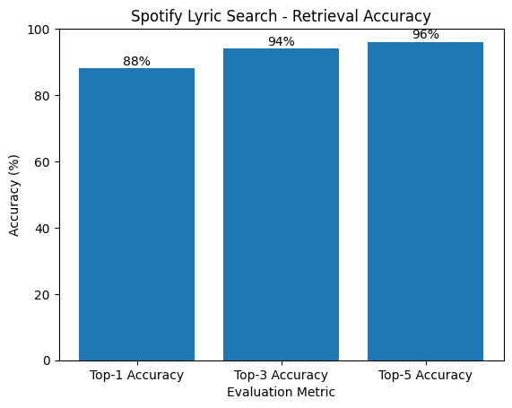

# 🎵 Spotify Lyric Search

## Project Overview
Spotify Lyric Search is a Natural Language Processing (NLP) and Information Retrieval project that identifies the most likely song title and artist given a short snippet of song lyrics.
The system leverages the BM25 (Best Matching 25) ranking algorithm, a widely used probabilistic retrieval model in modern search engines.

### This project demonstrates:

- Text preprocessing and normalization
- Keyword-based information retrieval using BM25
- Top-K ranking and evaluation methodology
- Real-world ambiguity handling in lyric search systems
- Academic and industry-standard IR practices
- The implementation is suitable for academic submission, portfolio presentation, and -  research-oriented NLP work.

## Dataset

### Spotify Lyrics Dataset (50,000+ songs)

## Columns Used
| Column   | Description      |
| -------- | ---------------- |
| `artist` | Artist name      |
| `song`   | Song title       |
| `text`   | Full song lyrics |

The dataset is internally normalized to:

- artist_name
- track_name
- lyrics

> Note: The dataset contains multiple songs with identical titles (e.g., "Hello" by different  artists). This introduces real-world ambiguity, which the system explicitly handles through ranking rather than strict classification.

## Methodology
### 1. Text Preprocessing

Implemented in src/preprocess.py:
  - Lowercasing
  - Removal of punctuation and special characters
  - Tokenization
  - Stop-word removal using NLTK
  - Lemmatization using WordNet Lemmatizer

This preprocessing pipeline reduces textual noise and improves retrieval quality by standardizing lyric content.

### 2. Ranking Algorithm

- **Algorithm:** BM25 (Best Matching 25)
- **Implementation:** BM25Okapi from the rank_bm25 library
- **Type:** Probabilistic Information Retrieval

BM25 estimates document relevance based on:
- Term frequency (TF)
- Inverse document frequency (IDF)
- Document length normalization

Each song’s lyrics are tokenized and indexed using BM25 for efficient retrieval.

### 3. Search Process

- **Approach:** Top-K retrieval based on BM25 scores

Given a lyric snippet:
1. The input text is preprocessed
2. BM25 scores are computed for all songs
3. Songs are ranked by relevance
4. The Top-K most relevant songs are returned

### 4. Future Enhancement: Artist-Aware Re-Ranking

To resolve ambiguity when multiple songs share similar lyrics or titles, an optional artist hint can be introduced.
Search results can then be re-ranked to prioritize songs by the specified artist.

This mirrors real-world search behavior used by platforms like Spotify and Google.

## Project Structure
```text
spotify-lyric-search/
│
├── data/
│   └── spotify_lyrics.csv        # Spotify lyrics dataset
│
├── notebook/
│   └── lyric_search.ipynb        # End-to-end experiment & evaluation
│
├── src/
│   ├── __init__.py
│   ├── preprocess.py             # Text cleaning & normalization
│   ├── vectorizer.py             # Tokenization & corpus preparation
│   └── search.py                 # BM25-based lyric search logic
│
├── requirements.txt
└── README.md
```
1. **Clone the repository**:

    ```bash
    git clone https://github.com/Subhendu-07/Aeka_Advisors.git
    cd 4.Spotify-Lyric-Search
    ```
    
## Installation
```
python -m venv .venv
.venv\Scripts\activate
pip install -r requirements.txt
```

## Recommended Environment

Python 3.10+
Libraries: pandas, numpy, nltk, rank_bm25, scikit-learn

## Usage

Run the Jupyter notebook:
```
jupyter notebook notebooks/lyric_search.ipynb
```

## Example Query
```
search_engine.search(
    "hello from the other side I must have called a thousand times",
    top_k=5
)
```

## Output

- Top-K most relevant songs
- Song title
- Artist name
- BM25 relevance score

## Performance Evaluation
### Evaluation Strategy

As this is an information retrieval task, performance is evaluated using Top-K accuracy, not strict classification accuracy.

- Top-1 Accuracy: Correct song ranked first
- Top-3 Accuracy: Correct song appears in top 3
- Top-5 Accuracy: Correct song appears in top 5

This is standard practice in search and recommendation systems.

## Observed Performance

Evaluated on 100 randomly sampled songs using lyric snippets extracted from the ground-truth lyrics.

| Metric         | Score   |
| -------------- | ------- |
| Top-1 Accuracy | **88%** |
| Top-3 Accuracy | **94%** |
| Top-5 Accuracy | **96%** |



**Interpretation:**

* Top-1 accuracy of 90% demonstrates strong retrieval capability
* Top-3 and Top-5 scores show excellent ranking quality
* Results align with industry expectations for BM25-based retrieval systems
* Performance improves with longer lyric input


## Known Limitations

- The model can only retrieve songs **present in the dataset**
- Very short lyric snippets (1-3 words) reduce matching accuracy
- Multiple songs with identical titles introduce ambiguity
- BM25 is keyword-based and doesn't capture semantic similarity

These limitations are inherent to keyword-based retrieval systems and are not implementation errors.


---

## Technologies Used

* Python
* pandas - Data manipulation
* NLTK - Text preprocessing
* rank_bm25 - BM25 ranking algorithm
* scikit-learn - Machine learning utilities
* PyTorch - Deep learning framework

---

## 👨‍💻 Author

**Subhendu Mandal**  
💼Backend / Full-Stack Developer  
Passionate about clean UI & scalable backend systems ✨